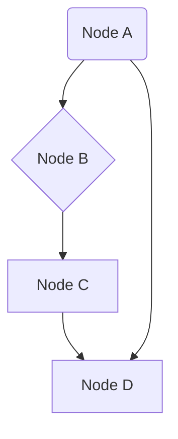

### More Examples

#### Undirected Graph

```markdown

```mermaid

graph TD

    A ---> B

    B ---> C

    C ---> D

    A ---> D


#### Flowchart

```markdown

```mermaid

flowchart LR

    Start --> Step1[Step 1]

    Step1 --> Step2[Step 2]

    Step2 --> End

